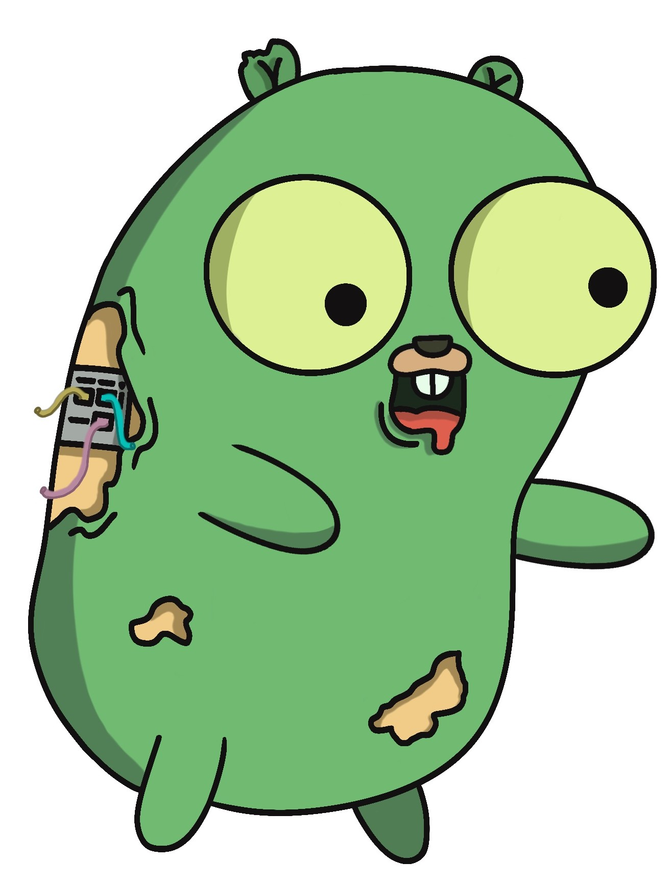
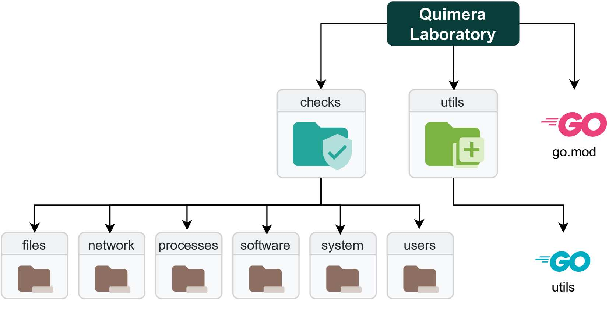

<p align="center">
    <a href="https://github.com/quimera-project/quimera-lab/commits/main">
    
    </a>
    <a href="https://github.com/quimera-project/quimera-lab/network/members">
        
    </a>
    <a href="https://github.com/quimera-project/quimera-lab/stargazers">
        
    </a>
    <a href="https://github.com/quimera-project/quimera-lab/issues">
        
    </a>
    <a href="https://github.com/quimera-project/quimera-lab/blob/main/LICENSE.md">
        
    </a>
</p>

<p align="center">
  <a href="https://github.com/quimera-project/quimera-lab">
    
  </a>

  <h1 align="center">Quimera Laboratory</h1>

  <p align="center">
    Quimera Laboratory proporciona un espacio de desarrollo para los binarios de los distintos checks, focalizado en Golang. Algunos de los checks necesitan apoyarse en un lenguaje como Go para conseguir un resultado mucho más eficaz y eficiente, con un código mucho más simple y organizado del que podría ofrecer un shell script. De todas formas, el repositorio puede almacenar, a su vez, binarios o scripts de otros lenguajes de programación, convirtiéndose así en un repositorio auxiliar para trabajar en la creación y testeo de binarios o scripts para los checks.
  </p>
</p>

> 🚧 Este proyecto proviene de un Trabajo Fin de Grado de Ingeniería de la Ciberseguridad. Se encuentra en una fase muy temprana del desarrollo y sufrirá diferentes cambios hasta llegar a una versión estable final.

## Instalación
```bash
git clone https://github.com/quimera-project/quimera-lab
```

## Uso

> Una vez creados y probados los ficheros correspondientes, estos deberán ser almacenados en Quimera Workshop. Quimera Laboratory no participa en el flujo de ejecución de Quimera y, por lo tanto, no es fundamental para el correcto funcionamiento de Quimera, siendo innecesario para el usuario final.

## Distribución

<p align="center">
    
</p>


<p align="justify">
El repositorio se divide en dos carpetas: utils y checks. La primera presta distintas utilidades, relacionadas con los checks, a modo de paquete de Golang para los binarios creados en la carpeta checks. De esta manera, las funciones y variables más relevantes pueden ser reutilizadas por todos los binarios, sin repetir código. Por otro lado, la carpeta checks se subdivide en carpetas relacionadas con la categoría del check a la que pertenence el binario o script almacenado en ellas.
</p>
